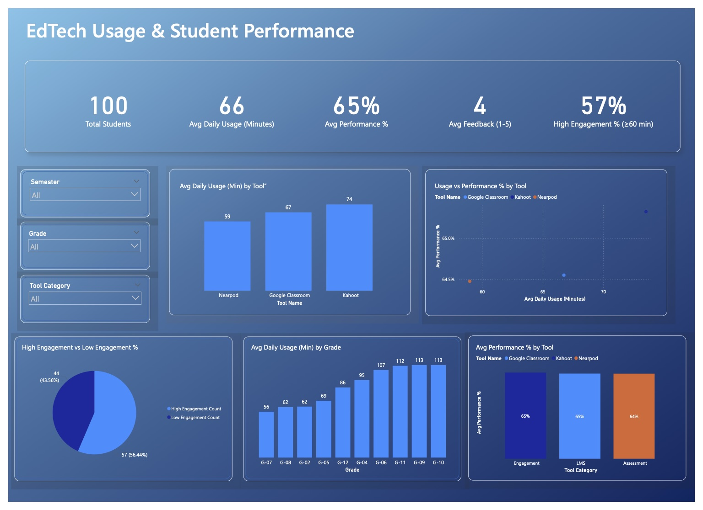

# EdTech Usage & Student Performance Dashboard

This project explores the relationship between EdTech tool usage (Google Classroom, Kahoot, Nearpod) and student performance & engagement.  
It combines PostgreSQL (Supabase) for data modeling and Power  for dashboard visualization.

---

## Dashboard Preview

[View Interactive Dashboard on Power BI Service](https://app.powerbi.com/view?r=eyJrIjoiMzQwNzBiOWQtMzA0Yi00MzRlLTk1MTItOTZjOGM1ZjIyN2M4IiwidCI6IjJjNWVlNjM4LWE5NjMtNDljMC1hYzI2LTgyOGRkOWI3OGQ1ZSIsImMiOjR9)

---

## Repository Contents

- `record_level_export.csv` → Exported dataset from the `analytics.v_usage_enriched` view.  
- `EdTech_Dashboard.pbix` → Power BI report file (download to explore locally).  
- `sql/` folder → All SQL scripts used in the project:  
- `create_tables.sql` → Creates base tables + unified analysis view.  
- `insert_data.sql` → Seeds synthetic demo data (100 students, random usage).     
- `kpi_cards.sql` → Script for 5 dashboard KPI cards.  
- `engagement_charts.sql` → Queries for visuals (usage by tool, grade, performance).  
- `assets/dashboard_cover.png` → Screenshot of the Power BI dashboard.

---

## Key Features

KPI Cards (Top Row):
- Total Students  
- Avg Daily Usage (Minutes)  
- Avg Performance %  
- Avg Feedback (1–5 scale)  
- High Engagement % (≥60 min usage)

Engagement Visuals:
- Avg Daily Usage by Tool  
- Usage vs Performance by Tool (scatter)  
- High vs Low Engagement (pie)  
- Avg Daily Usage by Grade  
- Avg Performance % by Tool Category  

---

## Tech Stack

- Database: PostgreSQL (via Supabase)  
- Data Modeling:SQL (views, KPIs, engagement banding)  
- Visualization: Power BI Desktop + Power BI Service  
- Version Control: GitHub  

---

## How to Reproduce

1. Database Setup
   - Run `sql/create_tables.sql` in Supabase/Postgres.  
   - (Optional) Run `sql/insert_data.sql` to generate synthetic demo data.  

2. Analysis Views
   - Use scripts in `sql/kpi_cards.sql` and `sql/engagement_charts.sql`.  
   - Export results as CSV (`record_level_export.csv`) if needed for Power BI.  

3. Dashboard
   - Open `EdTech_Dashboard.pbix` in Power BI Desktop.  
   - Or view the [live interactive dashboard] (https://app.powerbi.com/view?r=eyJrIjoiMzQwNzBiOWQtMzA0Yi00MzRlLTk1MTItOTZjOGM1ZjIyN2M4IiwidCI6IjJjNWVlNjM4LWE5NjMtNDljMC1hYzI2LTgyOGRkOWI3OGQ1ZSIsImMiOjR9)

---

 ## Author

- Nylah Jackson
- Graduate Student in Information Systems 
- [LinkedIn Profile](www.linkedin.com/in/nylah-jackson-38187623a)  

---

*License: MIT*
